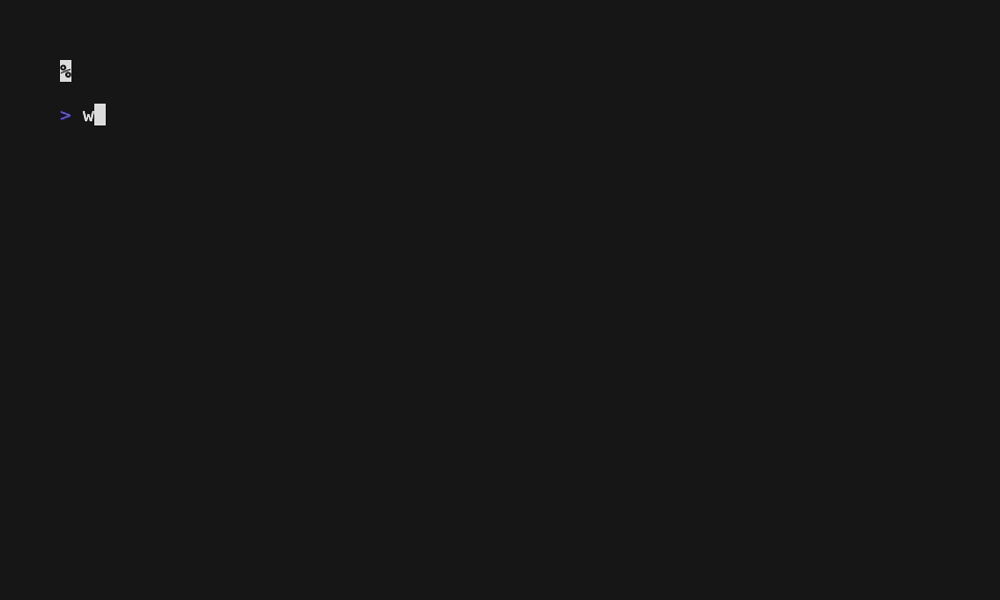

# willitrun

[](https://pypi.org/project/willitrun/)
[](https://pypi.org/project/willitrun/)
[](LICENSE)
[](https://github.com/smoothyy3/willitrun/actions)

### Find the best models for your device

Given a device and task category, willitrun ranks what runs best. Real benchmarks first, scaled estimates as fallback.


### Check if a specific model runs on your device

Pick any model by name, HuggingFace ID, or local file. Get a verdict, speed estimate, and memory breakdown instantly.



- **Real data first:** 556 measured benchmarks across NVIDIA Jetson, Apple Silicon, desktop GPUs, and more.
- **Inverse query:** given a device, rank the best-performing models for a task category.
- **Edge to cloud:** Jetson, Apple Silicon, desktop GPUs, SBCs.
- **Vision + LLMs:** exact benchmark lookup with FLOPs/memory-based estimation as fallback.
- **MoE-aware:** distinguishes total vs active parameters for memory and speed estimation.
- **CLI-first:** fast, scriptable, offline-capable once the DB is installed.

## Quick Start

```bash
pipx install willitrun   # recommended: isolated install
willitrun                # interactive mode
```

Or with pip:
```bash
pip install willitrun
willitrun
```

Install extras for local file profiling:
```bash
pip install willitrun[profiling,onnx]   # PyTorch / ONNX parsing
```

### Supported model inputs
- Model name from DB (`yolov8n`, `resnet50`, ...)
- HuggingFace model ID
- Local PyTorch / ONNX file

## How it works

### Estimation
- **Tier 1 (lookup):** exact model + device match from the SQLite benchmark DB.
- **Tier 2 (estimate):** FLOPs/TFLOPS scaling with memory fit check and 20% overhead. MoE models use active parameters for speed and total parameters for memory.

Results from real measurements always rank above estimates. Tier 2 results are clearly labelled.

### Data pipeline
- **Raw (immutable cache):** ingest scripts store HTTP responses in `data/raw/{source}/` with configurable TTL.
- **Normalized:** scripts parse raw data into JSONL at `data/normalized/{source}.jsonl` using the `BenchmarkRecord` schema (`willitrun/pipeline/schema.py`).
- **Serving:** `make build_db` validates, deduplicates by source priority, and writes `data/benchmarks.db`. The packaged copy in `willitrun/data/` is refreshed before each release.

## Commands

```bash
willitrun                                      # interactive mode
willitrun <model> --device <device>            # model check
willitrun --device <device> --task <category>  # best models for device
willitrun --list-devices
willitrun --list-models
willitrun <model> --device <device> --json
```

Pipeline (data contributors):
```bash
make fetch       # run all ingests (respects cache TTL)
make build_db    # normalized -> SQLite + metadata
make status      # coverage summary + gaps
make wheel       # rebuild DB, sync into package, build wheel
```

## Contributing data

1. Add benchmarks: append JSON lines to `data/normalized/<source>.jsonl` following `BenchmarkRecord`.
2. Add devices/models: edit `data/devices.yaml` / `data/models.yaml`.
3. Rebuild: `make build_db`.
4. Run tests: `pytest`.
5. Open a PR with the updated normalized file(s), DB, and metadata.

## Development

```bash
pip install -e ".[dev]"
make build_db
pytest
```

## Limitations
- Tier 2 estimates rely on available reference benchmarks; uncommon model/device combos may show wider ranges.
- Ingest scripts need network access; cached raw files avoid re-fetching within TTL.

## Roadmap
- More benchmark data (community PRs welcome!)
- Web frontend for shareability
- Training memory estimation
- Multi-GPU / model parallelism awareness
- Auto-detect local hardware

## License
MIT